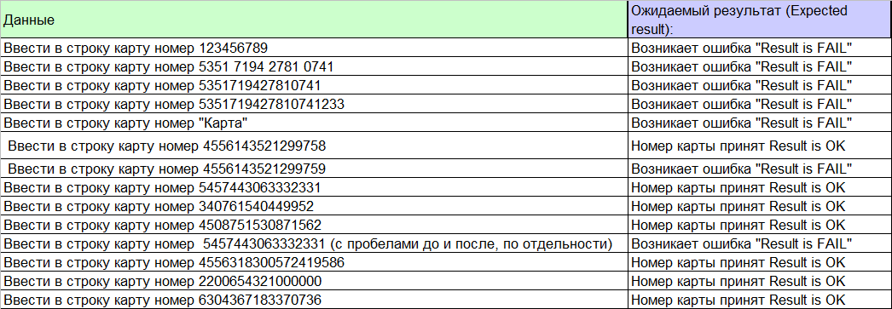

# Отчёт о тестировании  Credit Card Number Validator 

## Краткое описание

07.05.2021-07.05.2021 Было проведено функциональное и дымовое тестирование

На тестирование затрачено: 2 часа

В результате тестирования выявлены следующие дефекты:
* Ошибка при введении валидного значения карты American Express в приложении Credit Card Number Validator (https://github.com/netology-Marina/Credit-Card-Number-Validator/issues/1)
* Ошибка при введении валидного значения карты VISA имеющего больше 16 символов в приложении Credit Card Number Validator (https://github.com/netology-Marina/Credit-Card-Number-Validator/issues/2)
*
*

## Описание процесса тестирования

В процессе тестирования использовались следующие артефакты*:
* чек-лист (https://docs.google.com/spreadsheets/d/1fzxClacHTi5PiqJxbG2S_qXC70cbVAwNgP_j10k5m3Y/edit?usp=sharing)
* тест-кейс (https://docs.google.com/spreadsheets/d/1fzxClacHTi5PiqJxbG2S_qXC70cbVAwNgP_j10k5m3Y/edit?usp=sharing)

*Примечание\*: не указывайте артефакты "для галочки". Если вы сюда напишите **тест-план**, то мы попросим вас его показать (а если не покажете - то отправим работу на доработку). Пишите только то, что реально существует и требуется в задании.*

В качестве тестовых данных использовались данные:  https://www.freeformatter.com/credit-card-number-generator-validator.html:

Тестирование производилось в следующем окружении:
* ОС - х64
* версия Java -11
* IntelliJ IDEA